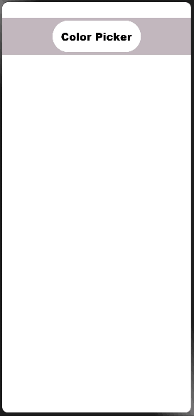
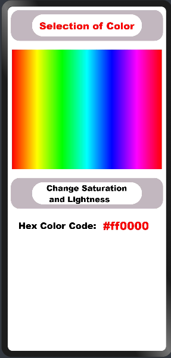
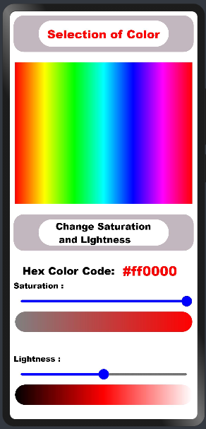
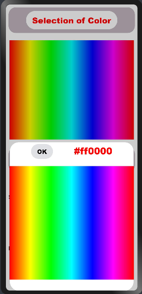

# ColorPicker
Color Picker in OpenHarmony

 
 


## Download & Install
Install using npm

```npm i @ohos/colorpicker```

Details about OpenHarmony NPM environment configuration, see at [here](https://gitee.com/openharmony-tpc/docs/blob/master/OpenHarmony_npm_usage.md)


## Usage Instructions
1. Import files and code dependencies
```
import { colorPicker }  from '@ohos/colorpicker'
```
2. Initialize ColorPicker model data
```
private model: colorPicker.Model = new colorPicker.Model()
```
3. Code for creating ColorPicker Screen
```
  private model: colorPicker.Model = new colorPicker.Model()
  build() {
    Column() {
      colorPicker({ model: this.model })
    }
  }
  ```
  
 
 
  
4. Code for creating colorDialog Screen
```
dialogController: CustomDialogController = new CustomDialogController({
    builder: colorDialog({ action: (value) => this.onAccept(value) }),
    cancel: this.existApp,
    autoCancel: true,
    alignment: DialogAlignment.Bottom,
  });
  
  onAccept(value: number) {
    this.hue = value;
    var RGBPixels = this.HSLToRGB(this.hue, this.SliderSaturation, this.SliderLightness)
    var HEXCode = this.rgbToHex(RGBPixels[0], RGBPixels[1], RGBPixels[2])
  }

  existApp() {
    this.OpacityofScreen = 1
    console.log("Cancel dialog!");
  }
  ```

 


### Use Cases
1. Use the button **Color Picker** to open the ColorPicker Screen .

2. In ColorPicker Screen, use button **Selection of Color** to open the customDialog and choose the main color.

3. Use the button **Change Saturation and Lightness** to change the saturation and lightness of the main color and choose any variation of it.

4. **HEX-Code** of the selected color will be upddated on the screen.


## Directory Structure
```
|---- ColorPicker (Project Name)
|     |---- color_picker (Color Picker Library)
|           |---- src
|                 |---- main
|                       |---- ets
|                             |----components
|                                   |---- MainPage
|                                         |---- colorDialog.ets
|                                         |---- colorPicker.ets
|           |---- index.ets
|
|     |---- entry
|           |---- src
|                 |---- main
|                       |---- ets
|                             |----pages
|                                   |---- colorPickerUI.ets
|                                   |---- index.ets

```

## Compatibility
Supports OpenHarmony API version 8 or above

## Code Contribution

If you find any problems during usage, you can submit
an [Issue](https://github.com/Applib-OpenHarmony/ColorPicker/issues) to us. Of course, we also welcome you to
send us [PR](https://github.com/Applib-OpenHarmony/ColorPicker/pulls).

## Open source License

This project is based
on [Apache License 2.0](https://github.com/Applib-OpenHarmony/ColorPicker/blob/main/LICENSE), please enjoy and
participate in open source freely.

## Reference
Design by: [Ayush](https://github.com/AyushLM)
