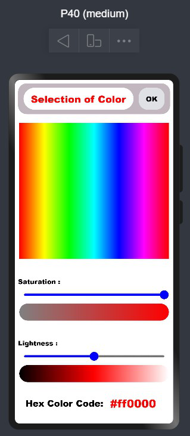

# ColorPicker
Color Picker in OpenHarmony

## Download & Install
Install using npm

```npm i @ohos/color_picker```

Details about OpenHarmony NPM environment configuration, see at [here](https://gitee.com/openharmony-tpc/docs/blob/master/OpenHarmony_npm_usage.md)


## Installation
1. Import files and code dependencies
```
import { colorPicker }  from '@ohos/color_picker'
```
2. Initialize ColorPicker model data
```
private model: colorPicker.Model = new colorPicker.Model()
```
3. Code for creating ColorPicker Screen
```
  private model: colorPicker.Model = new colorPicker.Model()
  build() {
    Column() {
      colorPicker({ model: this.model })
    }
  }
  ```
  
 
  


## Usage Instructions
1. Use the button **Color Picker** to open the ColorPicker Screen .

2. In ColorPicker Screen, use button **Selection of Color** to open the customDialog and choose the main color.

3. Change **Saturation** and **Lightness** to choose any variation of that main color.

4. On pressing **OK**, HEX-Code of selected color will be printed in previewer log.

## Directory Structure
```
|---- ColorPicker (Project Name)
|     |---- color_picker (Color Picker Library)
|           |---- src
|                 |---- main
|                       |---- ets
|                             |----components
|                                   |---- MainPage
|                                         |---- colorDialog.ets
|                                         |---- colorPicker.ets
|           |---- index.ets
|
|     |---- entry
|           |---- src
|                 |---- main
|                       |---- ets
|                             |----MainAbility
|                                   |---- pages
|                                         |---- colorPickerUI.ets
|                                         |---- index.ets

```

## Compatibility
Supports OpenHarmony API version 8
